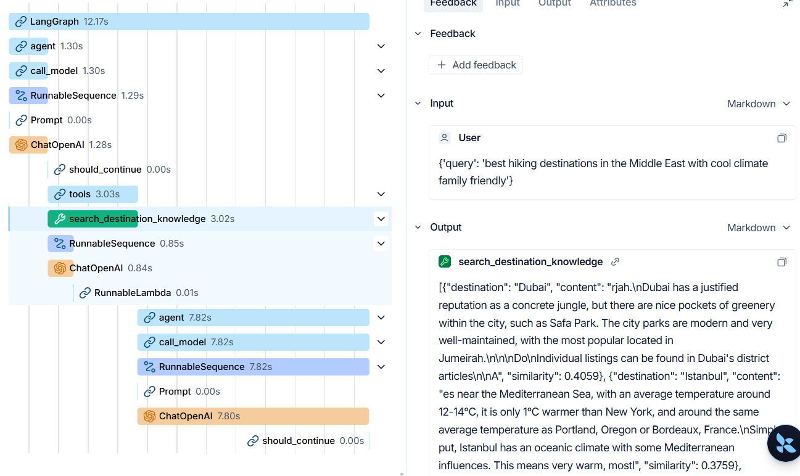

# Smart Travel Planner

An AI-powered travel planning agent. You describe your trip: budget, vibe, dates, and it figures out what kind of traveller you are, pulls up destination knowledge, checks live weather and flight estimates, and delivers a full plan. Built with FastAPI, LangGraph, pgvector, and React.

---

## Architecture

Here is how the pieces connect, from your browser all the way to the database:

```
┌─────────────────────────────────────────────────────────────┐
│                    Your Browser                             │
│              React + Vite  (port 5173)                      │
│   Login / Register / Chat UI / Tool call inspector          │
└──────────────────────────┬──────────────────────────────────┘
                           │  HTTP + JWT
┌──────────────────────────▼──────────────────────────────────┐
│                  FastAPI Backend  (port 8000)               │
│                                                             │
│  /auth/register   /auth/login   /auth/me                    │
│  /chat            /sessions     /sessions/{id}/messages     │
│                                                             │
│  ┌──────────────────────────────────────────────────────┐   │
│  │              LangGraph Agent                         │   │
│  │                                                      │   │
│  │  gpt-4o  ──────────────────────────────────────────  │   │
│  │  (reasoning + final answer)                          │   │
│  │                                                      │   │
│  │  Tools the agent can call:                           │   │
│  │  ┌──────────────────┐  ┌──────────────────────────┐  │   │
│  │  │search_destination│  │  get_live_conditions     │  │   │
│  │  │   _knowledge     │  │  weather + FX rates      │  │   │
│  │  │  (RAG via        │  │  (Open-Meteo API, free)  │  │   │
│  │  │   pgvector)      │  └──────────────────────────┘  │   │
│  │  └──────────────────┘  ┌──────────────────────────┐  │   │
│  │  ┌──────────────────┐  │  web_search              │  │   │
│  │  │classify_         │  │  (DuckDuckGo, real-time) │  │   │
│  │  │destination       │  └──────────────────────────┘  │   │
│  │  │(scikit-learn RF) │                                │   │
│  │  └──────────────────┘                                │   │
│  │                                                      │   │
│  │  gpt-4o-mini  (query rewriting inside RAG tool)      │   │
│  └──────────────────────────────────────────────────────┘   │
│                                                             │
└─────────────────┬────────────────────┬──────────────────────┘
                  │                    │
     ┌────────────▼──────┐    ┌────────▼──────────────┐
     │  Postgres + pgvector   │  Slack Webhook        │
     │  (port 5432)      │    │  Trip plan delivered  │
     │                   │    │  to your channel      │
     │  users            │    └───────────────────────┘
     │  chat_sessions    │
     │  chat_messages    │
     │  agent_runs       │
     │  tool_calls       │
     │  documents        │
     │  (embeddings)     │
     └───────────────────┘
```

**How a single chat message flows through the system:**

1. You type a message → React sends it to `/chat` with your JWT
2. FastAPI validates your token and loads your session
3. The LangGraph agent receives your message
4. The agent calls tools as needed (RAG, weather, classifier, web search)
5. `gpt-4o` synthesizes everything into a final answer
6. The answer + all tool calls are saved to Postgres
7. A Slack message is fired in the background
8. The response (answer + tool details) is returned to the browser

---

## Dataset Labeling Rules

The classifier was trained on a hand-labeled dataset of 150 destinations.

### The 6 travel styles

| Style | What it means |
|---|---|
| **Adventure** | Hiking, trekking, extreme sports, remote nature |
| **Budget** | Low daily cost, backpacker-friendly, hostels |
| **Culture** | Historical sites, museums, local traditions, architecture |
| **Family** | Child-friendly, safe, activities for all ages |
| **Luxury** | High-end resorts, fine dining, premium experiences |
| **Relaxation** | Beaches, spas, slow pace, scenery |

### Labeling rules

- **One label per destination** — every destination gets exactly one dominant travel style. If a place could fit two styles, the most dominant one wins (e.g. Bali is Relaxation, not Culture, even though it has temples).
- **25 destinations per class** — perfectly balanced at 150 total. No class imbalance to handle.
- **Label by the dominant visitor type** — what do most travellers go there for? A cheap cultural city (ex: Tbilisi) is Budget, not Culture, if cost is the main draw.
- **No text features** — labels are represented by 8 numeric scores (see below). The model never sees city names.

### The 8 features

| Feature | Range | What it captures |
|---|---|---|
| `avg_temp_c` | -50 to 50 | Climate |
| `beach_score` | 0 to 10 | Beach/coast quality |
| `mountain_score` | 0 to 10 | Hiking/mountains |
| `cultural_sites_score` | 0 to 10 | Museums, heritage |
| `nightlife_score` | 0 to 10 | Bars, clubs, scene |
| `avg_daily_cost_usd` | 0+ | Budget level |
| `luxury_index` | 0 to 10 | High-end options |
| `family_friendly_score` | 0 to 10 | Kid suitability |

### Why this works

`avg_daily_cost_usd` perfectly separates Budget from Luxury. `mountain_score` isolates Adventure. `beach_score` isolates Relaxation. `family_friendly_score` isolates Family. Culture and Adventure have some overlap because cheap cultural cities score similarly to budget trekking destinations — this is the main source of errors (see model results below).

---

## Chunking & Retrieval Rationale

### Source

**Wikivoyage**: a travel-specific wiki covering activities, costs, transport, and accommodation per destination. Chosen over Wikipedia because it is written for travellers, not encyclopaedists.

12 destinations were ingested, producing ~24 documents.

### Chunking decisions

| Decision | Value | Why |
|---|---|---|
| Chunk size | 300 characters | Wikivoyage paragraphs average 400-700 chars. 200 was too fragmented. 600 added noise from unrelated sentences. 300 kept one semantic unit per chunk. |
| Overlap | 50 characters (17%) | Prevents a sentence that spans a chunk boundary from being lost in both chunks. |
| Embedding model | `text-embedding-3-small` | 1536 dimensions, cheap, fast, strong multilingual performance. |

### Retrieval decisions

| Decision | Value | Why |
|---|---|---|
| Similarity metric | Cosine (`<=>` in pgvector) | Standard for text embeddings; measures angle, not magnitude, so document length doesn't bias results. |
| k (results returned) | 4 | Tested 2 (missed important detail), 4 (best balance of relevance and noise), 6 (added irrelevant chunks). |
| Query rewriting | `gpt-4o-mini` rewrites the raw user question into a clean retrieval query (≤10 words) before embedding | Raw questions like "what should I do there in summer?" embed poorly. "Tokyo summer activities outdoor" retrieves much better. |

---

## ML Model Comparison

All models trained on 120 rows (80% of 150), evaluated with 5-fold cross-validation. Test set (30 rows) touched exactly once at the end.

| Model | CV F1 Mean | CV F1 Std | AUC |
|---|---|---|---|
| Baseline (majority class) | 0.0476 | 0.0000 | 0.500 |
| Logistic Regression | 0.8026 | 0.0634 | 0.9746 |
| Random Forest | 0.8029 | 0.0687 | 0.9669 |
| Gradient Boosting | 0.7922 | 0.0681 | 0.9475 |
| **rf_tuned** ← winner | **0.8204** | **0.0742** | **0.9758** |
| gb_tuned | 0.8221 | 0.0798 | 0.9244 |

### Why rf_tuned was chosen

- **Highest AUC (0.9758)**: AUC measures probability calibration across all thresholds, not just the winning class. The agent relies on `predict_proba` to show confidence scores, so calibration matters more than raw F1.
- F1 difference from gb_tuned is 0.0017: negligible.
- rf_tuned has lower std (0.0742 vs 0.0798): more consistent across folds.
- Best hyperparameters: `max_depth=None`, `min_samples_split=10`, `n_estimators=200`.

### Test set results (rf_tuned, 30 rows, seen once)

| Class | Precision | Recall | F1 |
|---|---|---|---|
| Adventure | 1.00 | 1.00 | 1.00 |
| Budget | 1.00 | 1.00 | 1.00 |
| Culture | 1.00 | 0.80 | 0.89 |
| Family | 0.83 | 1.00 | 0.91 |
| Luxury | 1.00 | 1.00 | 1.00 |
| Relaxation | 1.00 | 1.00 | 1.00 |
| **Macro avg** | **0.97** | **0.97** | **0.97** |

1 error out of 30: Family and Culture were the hardest classes; 1 Culture destination was misclassified as Family. Adventure, Budget, Family, Luxury, and Relaxation all achieved perfect recall. All errors occurred between adjacent classes with genuine feature overlap; no misclassifications between distant classes like Budget and Luxury.

---

## Per-Query Cost Breakdown

A typical query (e.g. "Plan a 1-week trip to Tokyo") triggers:

| Step | Model | Est. input tokens | Est. output tokens | Cost |
|---|---|---|---|---|
| RAG query rewrite | gpt-4o-mini | ~80 | ~15 | ~$0.000013 |
| Agent: decide which tools to call | gpt-4o | ~350 | ~60 | ~$0.0015 |
| Agent: read tool results, decide next step | gpt-4o | ~700 | ~60 | ~$0.0022 |
| Agent: final answer synthesis | gpt-4o | ~1,000 | ~400 | ~$0.0065 |
| **Total per query** | | | | **~$0.01** |

Pricing used: gpt-4o at $2.50/1M input + $10.00/1M output. gpt-4o-mini at $0.15/1M input + $0.60/1M output. Token counts are estimates — actual usage visible in LangSmith traces.

---

## LangSmith Trace

Every agent run is traced end-to-end in LangSmith. You can see exactly which tools fired, what they received, what they returned, and how long each step took.



The trace above shows a query about hiking destinations in the Middle East:
- Total run: **12.17 seconds**
- The agent called `search_destination_knowledge` (3.02s); the RAG tool searched pgvector and returned destination content for Dubai and Istanbul
- The agent then made a second model call (7.82s) to synthesize the retrieved knowledge into a final answer

To view your own traces, open [smith.langchain.com](https://smith.langchain.com) and navigate to the `smart-travel-planner` project.

---

## Optional Extensions Completed

| Extension | How it was implemented |
|---|---|
| **Structured logging** | `structlog` used throughout the backend: every route, tool, and service emits structured JSON logs with context fields (session_id, duration_s, query, etc.) |
| **4th tool: web search** | `web_search` tool added using DuckDuckGo: gives the agent real-time web access for flight prices, visa requirements, and travel advisories not in the knowledge base |
| **Token usage logging** | `_TokenLogger` callback records prompt and completion token counts after every LLM call |
| **Per-tool persistence** | Every tool call is saved to the `tool_calls` table with its input, output, duration, and any error; full audit trail per agent run |
| **Session memory** | LangGraph `MemorySaver` keeps conversation context across messages in the same session; the agent remembers what you said earlier in the chat |

---

## Running Locally

**Requirements:** Docker Desktop

```bash
# 1. Clone the repo
git clone <repo-url>
cd smart-travel-planner

# 2. Create your .env file
cp backend/.env.example backend/.env
# Fill in: OPENAI_API_KEY, JWT_SECRET, SLACK_WEBHOOK_URL, LANGSMITH_API_KEY

# 3. Start everything
docker compose up

# 4. Open the app
# Frontend: http://localhost:5173
# API docs: http://localhost:8000/docs
```

## Running Tests

```bash
cd backend
uv sync --all-groups
uv run pytest tests/ -v
```

---

## Tech Stack

| Layer | Technology |
|---|---|
| Frontend | React + Vite + Tailwind CSS |
| Backend | FastAPI (Python 3.12) |
| Agent | LangGraph `create_react_agent` + `MemorySaver` |
| LLM | OpenAI `gpt-4o` (reasoning), `gpt-4o-mini` (query rewriting) |
| Embeddings | `text-embedding-3-small` (1536 dims) |
| Database | Postgres 16 + pgvector |
| ORM | SQLAlchemy 2.x async |
| Auth | JWT + bcrypt |
| Tracing | LangSmith |
| Webhook | Slack Incoming Webhook |
| Package manager | uv |
| Containerisation | Docker + Docker Compose |